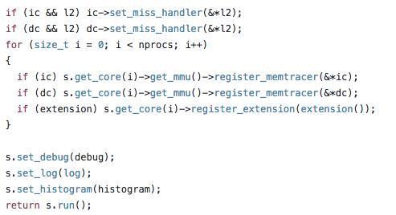
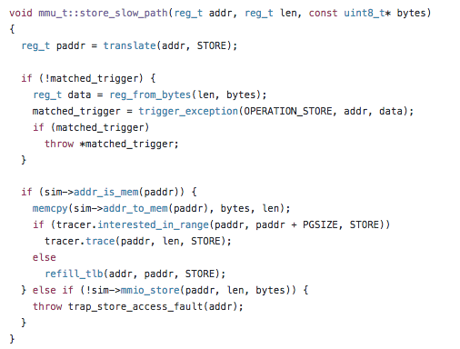
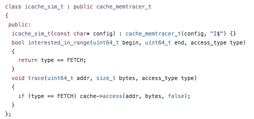
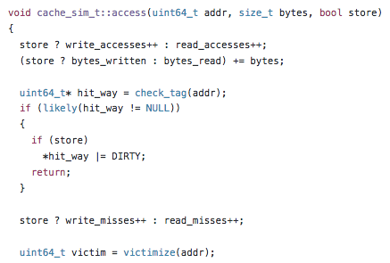
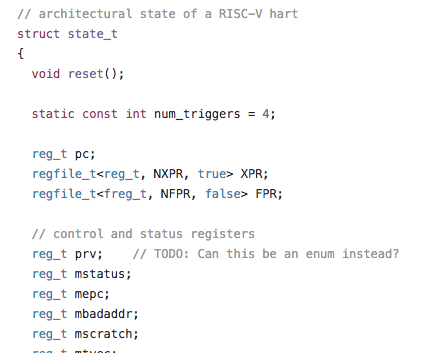
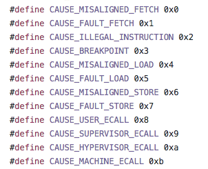
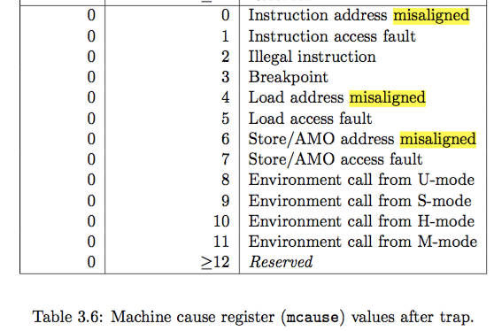
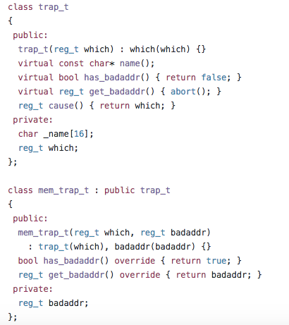
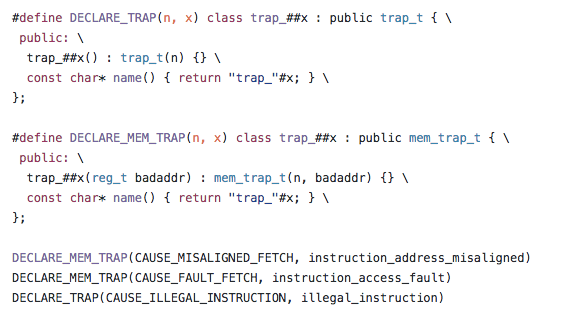
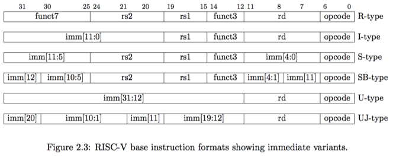

# Tutuorial on Spike Internal

Documentation contributor: Po-wei Huang 

Acknowledgement
==================
I would like to thank the following people for their time, feedback, and contribution: 
Wei-Song

Tutorial on Spike Internal
==================
*   [Goal of this document](#goal)
*   [Which branch is being tageted?](#target)
*   [Top Level View](#Top)
    *   [What they model?](#model_top)
    *   [Spike's source code](#source_top)
*   [Memory System Overview](#Memory)
    *   [What they model?](#model_memory)
*   [TLB & MMU](#MMU_TLB)
    *   [Spike's source code?](#source_MMU_TLB)
*   [Cache simulation](#Cache_sim)
    *   [Spike's source code?](#source_cache)
    *   [Result of cache simulation](#Result_of_cache)
*   [Processor Overview](#Processor)
    *   [What to model?](#model_processor)
*   [Hart modeling](#hart)
    *   [What to model](#model_hart)
    *   [Spike's implementation](#source_hart)
*   [Trap modeling](#trap)
    *   [What to model](#model_trap)
    *   [Spike's implementation](#source_trap)
*   [Interrupt modeling](#interrupt)
*   [Exception modeling](#interrupt)
*   [Bus and Miscellaneous devices](#bus)
    *   [Device Simulation](#device_sim)
*   [Appendix](#appendix)
    *   [Dealing with Instructions](#Instruction)
<h2 id="goal">Goal of this document</h2>
* Let people understand the implementation of Spike. 
* Work with Spike to help people understand RISC-V more as Spike is a golden reference 
* Provide information about how to use the spike, especially those features that are in the code but not well known to people. Ex. cache simulation, multi-core simulation.   
 
As Spike is a functional simulator, the simulator structure would not necessarily match the hardware structure. In order to make simulation faster,  sometimes simulator optimization will be used, and these optimization will make the structure completely different. We will try to point out these difference when we meet them.  

<h2 id="target">Which branch is being tageted?</h2>
This tutorial is for branch master from the RISC-V ISA SIM repo and the commit is daaf28f7296c0a5f5c90fe6646a4f8a73a720af5. 

<h2 id="Top">Top Level View</h2>
<h3 id="model_top">What they model?</h3>
For spike, they use a multi-core framework. Each core includes a MMU for virtual memory, and all of the core have a common I$ and D$. Then, both I$ and D$ connect to a single L2$. The main memory follows.  
  

The cores and the memory hierarchy are inside a class sim, and the class could interact with outside by interactive command. Moreover, the sim includes  bus, debug module, boot rom, and real time clock (RTC) . The processors, boot ROM, debug module and RTC are hooked on the bus, but the memory is not. These components together enable spike to run a simple proxy kernel pk.  
  
  
<h3 id="source_top">Spike's source code</h3>
	The code below comes from riscv-isa-sim/spike_main/spike.cc. You could see that I$ and D$ connect to L2$ by miss handler. Moreover, for each core, it has a mmu and the mmu connect to a single ic and dc.  
After all the components are connected, the method run is called to start the simulation.  

  
	On the other hand, inside riscv-isa-sim/riscv/sim.cc, you could see many bus.add_device(), just like the following figure shows. Spike use this function to attach device on bus. After these attachments are done, spike could start to run.  
	
  

<h2 id="Memory">Memory system overview</h2>
<h3 id="model_memory">What they model?</h3>  

  

The picture above is an overview of the memory system. The MMU contains a TLB, which could send back the data without invocation of cache. If the TLB fail, they will go through the table and access the cache. For cache, they model a write-back cache, and use sets/ways/line size to set the configuration. This scheme actually will make cache simulation inaccurate, but they do this in order to speed up performance of simulator.  

<h2 id="MMU_TLB">TLB & MMU</h2>
<h3 id="source_MMU_TLB">Spike's source code</h3>
When an instruction execute a load, it will call load function of MMU and use WRITE_RD to write the data back t register. Then, how to implement the MMU load?   
 
  
  
  

Below is an excerpt of riscv-isa-sim/riscv/mmu.h. The functions are defined in macro. The load will go through TLB first and then go to the slow path if TLB miss happens.   

 
Then, when TLB fail, MMU will call the slow path, and it will ask tracer to call trace. The trace will start to access the cache. Finally, when we jump to riscv-isa-sim/riscv/cachesim.h, we could see that the tracer will call access function of cache.  

  
<h2 id="Cache_sim">Cache_simulation</h2>
<h3 id="source_cache">Spike's source code</h3>
To understand how the cache is accessed, we could see riscv-isa-sim/riscv/cachesim.cc shown below. There are two functions, access and victimize. When tracer calls trace, the cache will call access.The access will check tag and then do the write or read. Moreover, it use lfsr to find the victim when a replacement happens.  

 
<h3 id="Result_of_cache">Result of Cache simulation</h3>
The picture below is a result of cache simulation. It could show read/write miss for I$, D$ and 
L2. Though it’s not accurate, it could provide a basic analysis.  

 
<h2 id="Processor">Processor_Overview</h2>
<h3 id="model_processor">What to model?</h3>
Basically, to model a processor, we need the following: 
* Model a RISC-V hart   
* Processor stepping, including fetch and execution. 
* Trap Handling including exception and interrupt handling. 
* Optional: MMU for VA->PA 
<h2 id="hart">Hart modeling</h2>
<h3 id="model_hart">What to model?</h3>
* Architecture state of a hart, including CSR, pc, registers and floating point registers.
<h3 id="source_hart">Spike’s implementation</h3>
Below is an excerpt from spike/riscv/processor.c. The state_t contains pc, register_file, and CSR. Notice that Spike only implement some of the CSR inside the hart. It implements other CSR in the processor.  

 
<h2 id="trap">Trap modeling</h2>
<h3 id="model_trap">What to model?</h3>
To model a trap, the followings are needed: 
* Cause of the trap. The information is in mcause ( machine cause register) 
* For memory related trap, the faulting address needs to be saved in mbadaddr (machine bad address register). 
* For trap caused by exception, virtual address of the instruction that encountered the exception. It’s in mepc(machine exception pc register). 
* For trap caused by interrupt? 
<h3 id="source_trap">What to model?</h3>
Inside encoding.h, the causes are defined.  

  

 
Inside trap.h , two base classes are defined. The which and badaddr are for the cause and faulting address respectively. Then, macros are used to construct classes for each kind of trap and the cause are saved into the class at the same time.  

  

 
Then, how about epc? (Todo) 
<h2 id="interrupt">Interrupt Modeling</h2>
Todo
<h2 id="exception">Exception Modeling</h2>
Todo
<h2 id="bus">Bus and Miscellaneous devices</h2>
<h3 id="device_sim">Device simulation</h3>
Related file: 
* riscv/device.h 
* riscv/device.cc 
In this section, we want to describe how to simulate or add a device. The devices inherit from a base class abstract_device_t, which has virtual functions load and store. Then, each device implements the load/store, and provides their special functions.  

 
In spike, five devices are simulated, including bus, rom, real time clock (rtc), processor and debug module.
<h2 id="appendix">Appendix</h2>
<h3 id="Instruction">Dealing with Instructions</h3>
Related file:  
* riscv/decode.h 
The spike use a class instruction_t to represent instructions. To extract each field, it defines functions like rs1() or rm(), as the following code shows.  

 
The number of x comes from the following encoding table from the spec.
 
